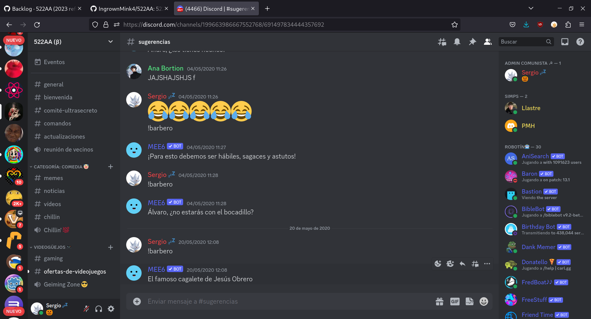

## 522AA Discord Server
Os presento al servidor 522AA. Un server divertido, dinamico y muy personalizado. 
Diseñado para la productividad y para el entretenimiento. 
Dispone de muchisimos bots super útiles y además cuenta con un gran sistema de moderación y roles.
La documentación y los recursos aún no están compartidos, pero en breve lo estarán.

# Licencia
Copyright © 2024 Sergio Varela

522AA is free software: you can redistribute it and/or modify it under the terms of the GNU General Public License as published by the Free Software Foundation, either version 3 of the License, or (at your option) any later version.

522AA is distributed in the hope that it will be useful, but WITHOUT ANY WARRANTY; without even the implied warranty of MERCHANTABILITY or FITNESS FOR A PARTICULAR PURPOSE. See the GNU General Public License for more details.

You should have received a copy of the GNU General Public License. If not, see http://www.gnu.org/licenses/.

